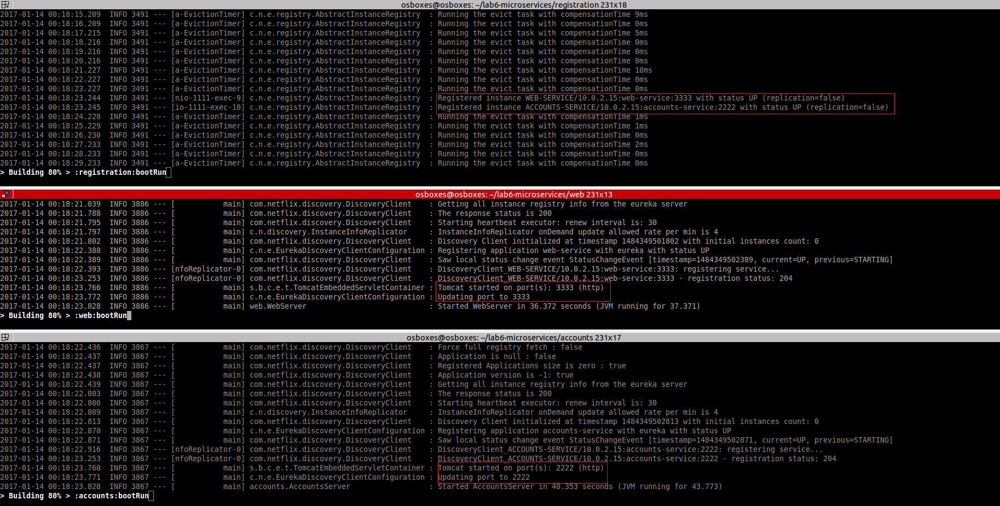
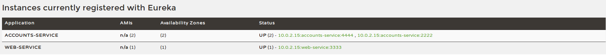
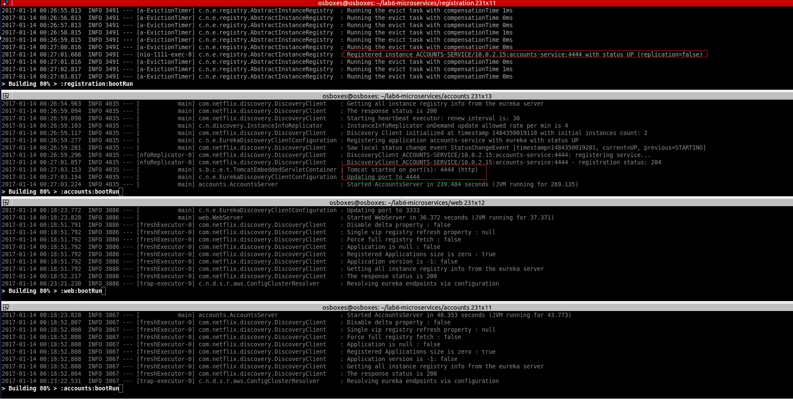

##1. The two microservices are running and registered (two terminals, logs screenshots).

##2. The service registration service has the two microservices registered (a third terminal, dashboard screenshots).

##3. A second account microservice is running in the port 4444 and it is registered (a fourth terminal, log screenshots).

##4. A brief report describing what happens when you kill the microservice with port 2222. Can the web service provide information about the accounts? Why?
When accounts server (port 2222) is killed and web server (port 3333) attemps to connect it answered with an error message ("connection refused"). 
The next time web server tries to connect, it asks Eureka about accounts service address and gets the correct server (port 4444).
